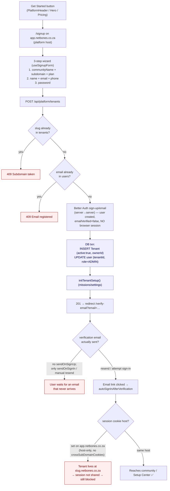
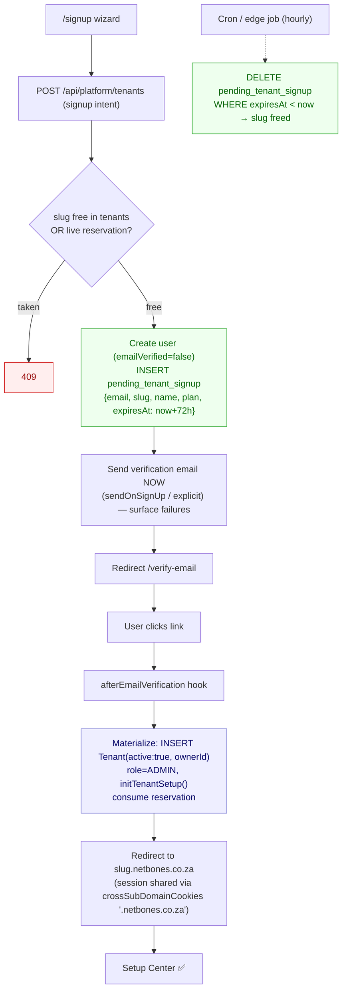

# Onboarding Refactor — Sign-up & Tenant Provisioning

**Status:** Proposal / analysis
**Context:** Phase 123 (Setup Center). Related bd: `soralia-village-zbvq` (401 hotfix), `soralia-village-0jh1` (Setup Center).
**Problem statement:** People create a subdomain (tenant) during sign-up, then fail email
authentication — leaving orphaned, slug-squatting, inaccessible tenants.

---

## 1. Current "Get Started → Sign-up" flow

Blue = irreversible resource allocation. Red = dead ends.

### Key source references

| Step                                  | File                                                                                                             |
| ------------------------------------- | ---------------------------------------------------------------------------------------------------------------- |
| Entry points                          | `src/features/platform/ui/PlatformHeader.tsx`, `HeroSection.tsx`, `PricingCards.tsx` → `/signup`                 |
| Wizard + submit                       | `src/features/auth/model/useSignupForm.ts`                                                                       |
| Provisioning                          | `src/app/api/platform/tenants/route.ts`                                                                          |
| Auth config                           | `src/shared/api/auth.ts` (`requireEmailVerification`, `sendOnSignIn`, `autoSignInAfterVerification`, `advanced`) |
| Verify page                           | `src/app/(auth)/verify-email/page.tsx`                                                                           |
| Sign-in (EMAIL_NOT_VERIFIED handling) | `src/app/(auth)/sign-in/page.tsx`                                                                                |
| Tenant schema                         | `src/db/schema/tenants.ts`                                                                                       |

---

## 2. Analysis — what we have

The root architectural issue: **the subdomain + tenant are provisioned eagerly, before
the identity is verified.** Irreversible resource allocation is coupled to an unverified
account.

| #      | Failure mode                                                                                                                         | Consequence                                                                                                 |
| ------ | ------------------------------------------------------------------------------------------------------------------------------------ | ----------------------------------------------------------------------------------------------------------- |
| **F1** | Tenant + slug created at signup, before verification (`tenants/route.ts:108`)                                                        | Zombie tenants if the user never verifies                                                                   |
| **F2** | `slug` uniqueness checked against the live table with no expiry/cleanup (`route.ts:45`)                                              | A real slug is permanently squatted by an abandoned signup; no reuse                                        |
| **F3** | No `sendOnSignUp` — only `sendOnSignIn: true` (`auth.ts:138`)                                                                        | User lands on `/verify-email` but no email is auto-sent; silent dead-end                                    |
| **F4** | Email send is fire-and-forget `.catch` (`auth.ts:134`)                                                                               | Delivery failure is invisible; user stuck, tenant orphaned                                                  |
| **F5** | Verify + auto-sign-in happens on `app.netbones.co.za`; cookie is host-only (no `crossSubDomainCookies` in `advanced`, `auth.ts:214`) | Even after verifying, session doesn't reach `slug.netbones.co.za` → owner locked out of their own community |
| **F6** | Re-submitting the same signup hits 409 on slug/email                                                                                 | User can't recover their own half-finished signup                                                           |

Net effect: "people create subdomains then fail email auth" produces **orphaned,
slug-squatting, inaccessible tenants** — and even the ones who _do_ verify may be locked
out by F5.

---

## 3. Proposed solution: provision-after-verification (reserve-then-commit)

Don't touch the live `tenants` table until the email is verified. Reserve the slug softly
with a TTL, materialize the tenant only on verification.

### How it addresses each failure

- **F1 / F2** — no tenant exists until verified; abandoned signups auto-expire and free the slug.
- **F3 / F4** — verification email sent immediately at signup, with delivery failures surfaced (return non-201 or an `emailQueued:false` flag the UI can act on).
- **F5** — configure `advanced.crossSubDomainCookies = { enabled: true, domain: '.netbones.co.za' }` and land verification on the tenant subdomain so the owner's session reaches their community. **Independent fix — needed regardless of provisioning approach.**
- **F6** — re-submitting refreshes the pending reservation / re-sends the email; no hard conflict.

---

## 4. Options considered

### Option A — Provision-after-verification (RECOMMENDED)

New table `pending_tenant_signup` holds the intent + a TTL slug reservation. Tenant is
materialized in the `afterEmailVerification` hook.

- ✅ No zombie rows in the live `tenants` table
- ✅ Slugs auto-freed; clean self-service retry
- ✅ Matches the "verify email first, then login" decision already taken in the 401 hotfix
- ➖ One new table + a reaper job + verification-hook materialization logic

### Option B — Pending tenant with lifecycle state + cleanup

Keep eager creation but insert the tenant as `active:false`; flip to `active:true` on
verification; treat `active:false` + expired as a free slug; reap stale rows.

- ✅ Smaller diff, no new table
- ➖ Zombie rows live in the production table
- ➖ Slug-uniqueness query must special-case expired-pending everywhere
- ➖ Higher risk of an `active:false` tenant leaking into tenant-resolution paths (`withTenant`, `getTenantByDomain`)

**Recommendation: Option A**, plus the cross-subdomain cookie fix (applies to both).

---

## 5. Implementation sketch (Option A)

1. **Schema** — `pending_tenant_signup { id, email (unique), slug (unique), name, plan, userId, expiresAt, createdAt }`. Migration via Prisma → regenerate Drizzle (`prisma/schema.prisma`, then `npx prisma migrate dev` + `npx prisma generate`).
2. **`POST /api/platform/tenants`** — replace tenant creation with: create user (unverified) → insert `pending_tenant_signup` → trigger verification email → return 201 (or 202) with `{ emailQueued }`. Slug check considers live tenants **and** unexpired reservations.
3. **Auth config (`src/shared/api/auth.ts`)**
   - `emailVerification.sendOnSignUp: true`
   - `emailVerification.afterEmailVerification` → materialize tenant from reservation, set `ownerId`/role, `initTenantSetup`, consume reservation, then route to `https://<slug>.netbones.co.za`.
   - `advanced.crossSubDomainCookies: { enabled: true, domain: '.netbones.co.za' }`.
4. **Reaper** — hourly job (Vercel cron / edge route) deleting expired reservations and their orphaned unverified users.
5. **UI** — `/verify-email` surfaces `emailQueued=false`; sign-in already handles `EMAIL_NOT_VERIFIED` and offers resend.
6. **Tests** — signup creates no tenant; verification materializes exactly one tenant; expired reservation frees the slug; re-submit is idempotent; cross-subdomain session reaches the tenant.

---

## 6. Follow-up issues (proposed)

- [ ] `pending_tenant_signup` table + migration
- [ ] Refactor `POST /api/platform/tenants` to reserve-then-commit
- [ ] Materialize tenant in `afterEmailVerification`
- [ ] Enable `crossSubDomainCookies` for `.netbones.co.za` (**F5**, do first — unblocks current flow)
- [ ] `sendOnSignUp: true` + surface email-delivery failures (**F3/F4**)
- [ ] Stale-signup reaper (cron)
