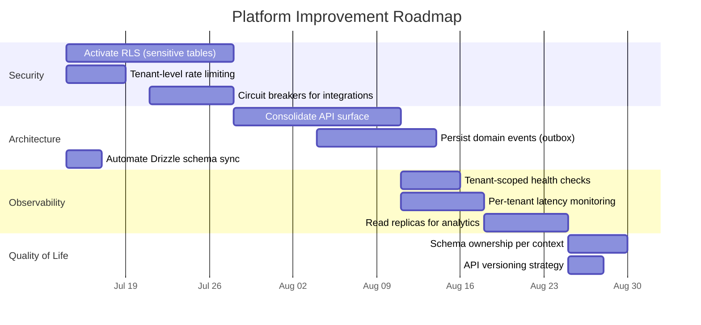

# NetComplex Platform Architecture Report

> Generated: 2026-07-11
> Purpose: Visual map of the multi-tenant platform with service relationships and improvement recommendations.

---

## 1. Multi-Tenant Architecture Diagram

```mermaid
graph TB
    subgraph "🌐 Ingress Layer"
        DNS[DNS: *.netbones.co.za / custom domains]
        CF[Cloudflare / CDN]
    end

    subgraph "🛡️ Middleware (src/middleware.ts)"
        MW[Host-based Router]
        RESOLVE[Tenant Resolver]
        PLANE{Plane?}
    end

    subgraph "🏗️ Control Plane — app.netbones.co.za"
        PLATFORM_MARKETING[Marketing / Pricing]
        PLATFORM_SIGNUP[Tenant Onboarding Wizard]
        PLATFORM_ADMIN[Super-Admin Tools]
        PLATFORM_BILLING[Billing / Subscriptions]
    end

    subgraph "🏘️ Data Plane — *.netbones.co.za"
        direction TB
        TENANT_CTX[Tenant Context Provider]

        subgraph "Bounded Contexts"
            IDENTITY[Identity & Auth]
            COMMS[Communication]
            PROPERTY[Property & Housing]
            MAINTENANCE[Maintenance]
            EVENTS[Events & Bookings]
            CONTENT[CMS & Content]
            COMMERCE[Commerce & Marketplace]
            FINANCE[Finance & dWallet]
            GOVERNANCE[Governance & Surveys]
            ENGAGEMENT[Engagement & Groups]
        end
    end

    subgraph "🔐 Auth Layer (Better Auth)"
        BA_SESSION[Session Management]
        BA_2FA[2FA / Passkeys / OTP]
        BA_ORG[Organization Plugin]
        BA_EMAIL[Email Verification / Resend]
    end

    subgraph "⚡ Infrastructure Services"
        DB[(PostgreSQL)]
        DRIZZLE[Drizzle ORM]
        PRISMA[Prisma Schema]
        TRPC[tRPC Server]
        OPENAPI[OpenAPI Gateway]
        REALTIME[Supabase Realtime]
        CACHE[Next.js ISR Cache]
        EVENTS[Domain Event Emitter]
        STORAGE[S3 File Storage]
        LOGGER[Pino Logger]
        RATE_LIMIT[Rate Limiter]
    end

    subgraph "🧩 Feature Gating"
        GATE[FeatureGate Layer]
        TIER[Subscription Tier]
        MODULE[Module Toggle]
        FLAG[Vercel Flags / Statsig]
    end

    DNS --> CF
    CF --> MW
    MW --> PLANE

    PLANE -->|"app.netbones.co.za"| PLATFORM_MARKETING
    PLANE -->|"app.netbones.co.za"| PLATFORM_ADMIN
    PLANE -->|"*.netbones.co.za / custom"| TENANT_CTX

    TENANT_CTX --> IDENTITY
    TENANT_CTX --> COMMS
    TENANT_CTX --> PROPERTY
    TENANT_CTX --> MAINTENANCE
    TENANT_CTX --> EVENTS
    TENANT_CTX --> CONTENT
    TENANT_CTX --> COMMERCE
    TENANT_CTX --> FINANCE
    TENANT_CTX --> GOVERNANCE
    TENANT_CTX --> ENGAGEMENT

    subgraph "🔑 Auth (Better Auth)"
        BA_SESSION[Session Mgmt]
        BA_2FA[2FA / Passkeys]
        BA_ORG[Organizations]
        BA_EMAIL[Email / Resend]
    end

    subgraph "🧩 Feature Gating"
        FG_TIER[Tier Check]
        FG_MODULE[Module Check]
        FG_FLAG[Vercel Flags / Statsig]
    end

    subgraph "📡 API Layer"
        TRPC[tRPC v11 — 23 Routers]
        REST[REST — 54 Routes]
        OPENAPI_GEN[OpenAPI 3.1 Spec]
    end

    subgraph "🗄️ Data Layer"
        PG[(PostgreSQL)]
        PRISMA_MIG[Prisma Migrations]
        DRIZZLE_Q[Drizzle Queries]
        RLS[RLS — Dormant]
    end

    subgraph "📤 External Integrations"
        RESEND[Resend — Email]
        PAYSTACK[Paystack — Payments]
        S3[S3 — File Storage]
        POSTHOG[PostHog — Analytics]
        AI[AI Provider Pool]
    end

    DNS --> CF
    CF --> MW
    MW -->|"app.netbones.co.za"| PLANE_PLATFORM
    MW -->|"*.netbones.co.za"| PLANE_TENANT
    MW -->|"localhost"| PLANE_TENANT

    PLANE_PLATFORM --> PLATFORM_MARKETING
    PLANE_PLATFORM --> PLATFORM_ADMIN
    PLANE_PLATFORM --> PLATFORM_BILLING

    PLANE_TENANT --> TENANT_CTX
    TENANT_CTX --> IDENTITY
    TENANT_CTX --> COMMS
    TENANT_CTX --> PROPERTY
    TENANT_CTX --> MAINTENANCE
    TENANT_CTX --> EVENTS
    TENANT_CTX --> CONTENT
    TENANT_CTX --> COMMERCE
    TENANT_CTX --> FINANCE
    TENANT_CTX --> GOVERNANCE
    TENANT_CTX --> ENGAGEMENT

    TENANT_CTX --> GATE
    GATE --> TIER
    GATE --> MODULE
    GATE --> FLAG

    TENANT_CTX --> BA_SESSION
    BA_SESSION --> BA_2FA
    BA_SESSION --> BA_ORG
    BA_SESSION --> BA_EMAIL

    TENANT_CTX --> TRPC
    TENANT_CTX --> REST
    TRPC --> OPENAPI_GEN

    TRPC --> DB
    REST --> DB
    TRPC --> EVENTS
    TRPC --> RATE_LIMIT

    DB --> DRIZZLE_Q
    DB --> PRISMA_MIG
    DRIZZLE_Q --> PG
    PRISMA_MIG --> PG
    RLS -.->|"dormant"| PG

    TRPC --> REALTIME
    REALTIME --> COMMS

    TRPC --> STORAGE
    TRPC --> PAYSTACK
    TRPC --> POSTHOG
    BA_EMAIL --> RESEND

    subgraph "🧩 Feature Gating"
        FG_TIER[Tier Check]
        FG_MODULE[Module Check]
        FG_FLAG[Statsig / Vercel Flags]
    end

    TENANT_CTX --> FG_TIER
    TENANT_CTX --> FG_MODULE
    TENANT_CTX --> FG_FLAG

    subgraph "🔐 Auth (Better Auth)"
        BA_SESSION[Session]
        BA_2FA[2FA]
        BA_ORG[Organizations]
        BA_EMAIL[Email]
    end

    TENANT_CTX --> BA_SESSION
    BA_SESSION --> BA_2FA
    BA_SESSION --> BA_ORG
    BA_SESSION --> BA_EMAIL

    subgraph "📡 API Surface"
        TRPC[tRPC v11 — 23 Routers]
        REST_API[REST — 54 Routes]
        WEBHOOKS[Webhooks]
    end

    TENANT_CTX --> TRPC
    TENANT_CTX --> REST_API
    TRPC --> OPENAPI_GEN

    TRPC --> DB
    REST_API --> DB
    TRPC --> EVENTS
    TRPC --> RATE_LIMIT

    DB --> DRIZZLE_Q
    DB --> PRISMA_MIG
    DRIZZLE_Q --> PG
    PRISMA_MIG --> PG
    RLS -.->|"dormant"| PG

    TRPC --> REALTIME
    REALTIME --> COMMS

    TRPC --> STORAGE
    TRPC --> PAYSTACK
    TRPC --> POSTHOG
    BA_EMAIL --> RESEND

    subgraph "🧩 Bounded Contexts"
        IDENTITY[Identity & Auth<br/>users, profiles, roles]
        COMMS[Communication<br/>chat, messages, notifications]
        PROPERTY[Property & Housing<br/>properties, households, directory]
        MAINTENANCE[Maintenance<br/>requests, teams, providers]
        EVENTS[Events & Bookings<br/>facilities, RSVPs]
        CONTENT[CMS & Content<br/>articles, announcements]
        COMMERCE[Commerce<br/>marketplace, agents, services]
        FINANCE[Finance<br/>dWallet, merits, billing]
        GOVERNANCE[Governance<br/>surveys, disputes, education]
        ENGAGEMENT[Engagement<br/>groups, competitions, merits]
    end

    subgraph "🧩 Feature Gating"
        FG_TIER[Tier Check]
        FG_MODULE[Module Check]
        FG_FLAG[Statsig / Vercel Flags]
    end

    subgraph "🔐 Auth (Better Auth)"
        BA_SESSION[Session]
        BA_2FA[2FA]
        BA_ORG[Organizations]
        BA_EMAIL[Email]
    end

    subgraph "📡 API Surface"
        TRPC[tRPC v11 — 23 Routers]
        REST_API[REST — 54 Routes]
        WEBHOOKS[Webhooks]
    end

    subgraph "🗄️ Data Layer"
        DB[(PostgreSQL)]
        DRIZZLE_Q[Drizzle ORM]
        PRISMA_MIG[Prisma Migrations]
        RLS[RLS — Dormant]
    end

    subgraph "📤 External Integrations"
        RESEND[Resend — Email]
        PAYSTACK[Paystack — Payments]
        S3[S3 — File Storage]
        POSTHOG[PostHog — Analytics]
        AI_POOL[AI Provider Pool]
    end

    DNS --> CF
    CF --> MW
    MW --> PLANE

    PLANE -->|"app.netbones.co.za"| PLANE_PLATFORM
    PLANE -->|"*.netbones.co.za / custom"| PLANE_TENANT
    PLANE -->|"localhost"| PLANE_TENANT

    PLANE_PLATFORM --> PLATFORM_MARKETING
    PLANE_PLATFORM --> PLATFORM_ADMIN
    PLANE_PLATFORM --> PLATFORM_BILLING

    PLANE_TENANT --> TENANT_CTX
    TENANT_CTX --> IDENTITY
    TENANT_CTX --> COMMS
    TENANT_CTX --> PROPERTY
    TENANT_CTX --> MAINTENANCE
    TENANT_CTX --> EVENTS
    TENANT_CTX --> CONTENT
    TENANT_CTX --> COMMERCE
    TENANT_CTX --> FINANCE
    TENANT_CTX --> GOVERNANCE
    TENANT_CTX --> ENGAGEMENT

    TENANT_CTX --> FG_TIER
    TENANT_CTX --> FG_MODULE
    TENANT_CTX --> FG_FLAG

    TENANT_CTX --> BA_SESSION
    BA_SESSION --> BA_2FA
    BA_SESSION --> BA_ORG
    BA_SESSION --> BA_EMAIL

    TENANT_CTX --> TRPC
    TENANT_CTX --> REST_API
    TRPC --> OPENAPI_GEN

    TRPC --> DB
    REST_API --> DB
    TRPC --> EVENTS
    TRPC --> RATE_LIMIT

    DB --> DRIZZLE_Q
    DB --> PRISMA_MIG
    DRIZZLE_Q --> PG
    PRISMA_MIG --> PG
    RLS -.->|"dormant"| PG

    TRPC --> REALTIME
    REALTIME --> COMMS

    TRPC --> STORAGE
    TRPC --> PAYSTACK
    TRPC --> POSTHOG
    BA_EMAIL --> RESEND
```

---

## 3. Key Observations

### Strengths

| Area                 | Observation                                                                                            |
| -------------------- | ------------------------------------------------------------------------------------------------------ |
| **Tenant isolation** | Application-layer `tenantId` on every domain table — simple, predictable, no RLS complexity at runtime |
| **API surface**      | Dual tRPC + OpenAPI gives internal type-safety and external standards compliance                       |
| **FSD architecture** | Clear layer boundaries with Steiger + ESLint enforcement prevents dependency spaghetti                 |
| **Auth**             | Better Auth with cross-subdomain cookies, 2FA, passkeys, OTP — comprehensive                           |
| **Feature gating**   | 3-layer (tier → module → flag) gives fine-grained control per tenant                                   |
| **ISR strategy**     | aggressive caching with on-demand revalidation reduces serverless costs                                |
| **Dual ORM**         | Prisma for schema management, Drizzle for edge-compatible queries — pragmatic split                    |

### Pain Points

| Pain Point                          | Severity   | Details                                                                                                                                                                                                   |
| ----------------------------------- | ---------- | --------------------------------------------------------------------------------------------------------------------------------------------------------------------------------------------------------- |
| **Dual ORM overhead**               | Medium     | Prisma + Drizzle means two schema sources, two migration pipelines, two query APIs. Drizzle schema is auto-generated from Prisma but drift is possible.                                                   |
| **RLS is dormant**                  | High       | RLS policies exist for 18 tables but no production code path uses `app_user`. This is defense-in-depth that isn't deployed — a single SQL injection in the owner-role connection compromises all tenants. |
| **54 REST routes alongside tRPC**   | Medium     | Dual API surface creates confusion about which to use. Some REST routes duplicate tRPC functionality.                                                                                                     |
| **No service mesh / API gateway**   | Low-Medium | Direct host-based routing works but lacks rate limiting per tenant, circuit breakers, or request-level observability at the edge.                                                                         |
| **Single DB, single pool**          | Medium     | All tenants share one connection pool. A noisy-neighbor tenant can starve others. No read replicas for analytics queries.                                                                                 |
| **Event system is in-process only** | Medium     | Domain events use an in-process emitter — no persistence, no retry, no outbox pattern. Events are lost on crash.                                                                                          |
| **No tenant-level rate limiting**   | Medium     | Rate limiter is user/IP-based, not tenant-based. A single tenant's burst can degrade the whole platform.                                                                                                  |
| **Dual ORM drift risk**             | Low-Medium | Drizzle schema is auto-generated from Prisma but the generation step is manual. If someone forgets to regenerate, queries use stale schema.                                                               |
| **No read replicas**                | Low-Medium | All queries hit the primary. Analytics/reporting queries compete with transactional traffic.                                                                                                              |
| **No outbox pattern**               | Medium     | Domain events are in-process only. If the server crashes after a mutation but before event handlers run, events are lost.                                                                                 |

---

## 4. Improvement Recommendations

### 🔴 High Priority

| #   | Recommendation                     | Rationale                                                                                                                                                                          | Effort    |
| --- | ---------------------------------- | ---------------------------------------------------------------------------------------------------------------------------------------------------------------------------------- | --------- |
| 1   | **Activate RLS incrementally**     | Start with the 6 ADR-019 sensitive tables (users, profiles, etc.). Create a `runWithRLS()` wrapper and migrate one context at a time. This closes the single biggest security gap. | 2-3 weeks |
| 2   | **Add tenant-level rate limiting** | Wrap the rate limiter with a tenant-aware key (`tenantId:userId:action`). Prevents noisy-neighbor degradation.                                                                     | 3-5 days  |
| 3   | **Persist domain events**          | Replace the in-process emitter with an outbox pattern (write events to a DB table, process via a background job). Guarantees delivery even after crashes.                          | 1-2 weeks |

### 🟡 Medium Priority

| #   | Recommendation                   | Rationale                                                                                                                                              | Effort    |
| --- | -------------------------------- | ------------------------------------------------------------------------------------------------------------------------------------------------------ | --------- |
| 4   | **Consolidate API surface**      | Audit the 54 REST routes against tRPC routers. Deprecate duplicates, migrate unique REST endpoints to tRPC. Single API surface reduces cognitive load. | 2-3 weeks |
| 5   | **Add read replicas**            | Route analytics, reporting, and heavy read queries to a read replica. Keeps the primary pool responsive for transactional traffic.                     | 1 week    |
| 6   | **Tenant-level rate limiting**   | Extend the rate limiter to track per-tenant usage. Add a `X-Tenant-RateLimit-Remaining` header.                                                        | 3-5 days  |
| 7   | **Automate Drizzle schema sync** | Add a CI check that fails if Drizzle schema is stale relative to Prisma. Or switch to a single-source approach.                                        | 2-3 days  |
| 8   | **Add circuit breakers**         | Wrap external integrations (Resend, Paystack, S3) with circuit breakers. Prevents cascading failures when a downstream service is degraded.            | 1 week    |

### 🟢 Nice-to-Have

| #   | Recommendation                           | Rationale                                                                                                                  | Effort   |
| --- | ---------------------------------------- | -------------------------------------------------------------------------------------------------------------------------- | -------- |
| 9   | **Read replicas for analytics**          | Offload heavy queries (reporting, exports) to a read replica. Keeps the primary pool responsive.                           | 1 week   |
| 10  | **API versioning strategy**              | OpenAPI spec exists but no versioning strategy for breaking changes. Add `Accept-Version` header or URL prefix convention. | 2-3 days |
| 11  | **Tenant-scoped health checks**          | Add `/api/v1/tenant/health` that checks DB connectivity, auth, and key integrations for the current tenant.                | 1-2 days |
| 12  | **SLA monitoring per tenant**            | Track p50/p95/p99 latency per tenant. Alert when a specific tenant's experience degrades.                                  | 1 week   |
| 13  | **Schema ownership per bounded context** | Each bounded context should own its Drizzle schema files. Currently all 309 files are flat in `src/db/schema/`.            | 3-5 days |

---

## 5. Improvement Roadmap

---

## 5. Architectural Risks

| Risk                                        | Likelihood | Impact                                      | Mitigation                         |
| ------------------------------------------- | ---------- | ------------------------------------------- | ---------------------------------- |
| **SQL injection via owner-role connection** | Low        | **Critical** — all tenants exposed          | Activate RLS (Priority #1)         |
| **Event loss on crash**                     | Medium     | Medium — missed notifications, stale caches | Outbox pattern (#3)                |
| **Noisy-neighbor tenant**                   | Medium     | High — all tenants degraded                 | Tenant-level rate limiting (#2)    |
| **Dual ORM schema drift**                   | Low        | Medium — runtime query errors               | Auto-sync CI check (#4)            |
| **Single DB connection pool**               | Medium     | Medium — all tenants share one pool         | Read replicas + connection pooling |
| **In-process events**                       | Medium     | Medium — no retry on failure                | Outbox pattern (#3)                |

---

## 6. Architecture Evolution Suggestions

### Short-term (Next 2 weeks)

1. **Activate RLS on the 6 ADR-019 sensitive tables** (users, profiles, auth tables). This is the single biggest security gap.
2. **Add tenant-aware rate limiting** — wrap the existing rate limiter with a `tenantId:userId:action` key.
3. **Auto-sync Drizzle schema** — add a `pre-commit` or `pre-build` hook that regenerates Drizzle schema from Prisma and fails if there's a diff.

### Medium-term (Next month)

4. **Implement the outbox pattern** — write domain events to a `outbox` table, process via a cron job or Vercel background function. Guarantees delivery.
5. **Consolidate API surface** — audit the 54 REST routes, deprecate duplicates, migrate unique ones to tRPC. Single API surface reduces maintenance burden.
6. **Add read replicas** — configure Supabase read replicas, route analytics/reporting queries to the replica.

### Long-term (Next quarter)

7. **Activate RLS fully** — once the outbox pattern is in place and the API surface is consolidated, switch all queries to `app_user` role. RLS becomes the primary isolation mechanism.
8. **Consider per-tenant database sharding** — if any tenant exceeds 100K residents or 1M records, evaluate a sharding strategy (schema-per-tenant or database-per-tenant).
9. **Service mesh at the edge** — if the platform grows beyond 50 tenants, consider a lightweight service mesh (e.g., Envoy) for tenant-aware routing, circuit breaking, and observability.

---

## 6. Architecture Decision Log

| ID      | Decision                           | Status      |
| ------- | ---------------------------------- | ----------- |
| ADR-004 | Feature-Sliced Design architecture | ✅ Accepted |
| ADR-019 | RLS as defense-in-depth (dormant)  | ✅ Accepted |
| ADR-021 | Dual ORM: Prisma + Drizzle         | ✅ Accepted |
| ADR-022 | tRPC + OpenAPI dual surface        | ✅ Accepted |
| ADR-024 | Better Auth as auth provider       | ✅ Accepted |
| ADR-025 | Cross-subdomain cookies for auth   | ✅ Accepted |
| ADR-029 | Application-layer tenant isolation | ✅ Accepted |
| ADR-030 | In-process domain events           | ✅ Accepted |

---

## 6. Conclusion

The NetComplex platform has a **well-considered architecture** with clear separation of concerns, strong tenant isolation at the application layer, and a modern tech stack. The FSD architecture with Steiger enforcement keeps the codebase organized as it grows.

The **biggest risk** is the dormant RLS — the platform has defense-in-depth policies defined but not activated. Closing this gap should be the top priority.

The **biggest complexity burden** is the dual API surface (tRPC + REST) and dual ORM (Prisma + Drizzle). These were pragmatic choices but create ongoing cognitive overhead. Consolidation would improve developer velocity.

The **biggest architectural debt** is the in-process event system. As the platform grows, guaranteed event delivery becomes critical for consistency across bounded contexts.
