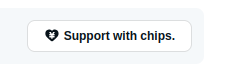

# CHIPS & DWALLET DISCUSSION

## PART ONE



Lets create a 'support with chips' component, so platform users can send chips to content creators (example, user sees a post he likes, currently we can heart, but no way of sending anything tangible)

I think this is an excellent fit for NetComplex, but I would position it as **part of the dWallet ecosystem**, not merely a "tip" button.

The phrase **"Support with chips"** feels much more community-oriented than "Tip", and reinforces that Chips are an internal appreciation currency rather than money.

The component you've mocked is already heading in the right direction.

## UX

Instead of exposing a payment flow immediately, make it a two-stage interaction.

```
❤️ 42      💬 8      🎁 Support with Chips
```

Clicking it opens a lightweight popover.

```
Support Sarah's article

How many chips?

[ 10 ] [ 25 ] [ 50 ] [100]
──────────────
Custom: [___]

Optional message

"Thanks for writing this!"

[Cancel]        [Send Chips]
```

After sending:

```
✓ You sent 25 Chips
```

---

## The receiver sees

Instead of a notification saying

> David tipped you.

they receive

```
🎉 David supported your article

+25 Chips

"Thanks for writing this!"
```

which feels much more rewarding.

---

# Show social proof

Rather than simply showing hearts:

```
❤️ 42

🎁 610 Chips received
```

or

```
❤️ 42
🎁 Supported by 18 residents
```

Both encourage further participation.

---

# Creator statistics

Each piece of content could display

```
Likes
Comments
Views
Chips Received
```

Example

```
❤️ 42
💬 8
👁 630
🎁 540 Chips
```

---

# Nice animation

When someone sends chips

✨✨✨

A small handful of chips could float upward and disappear.

Nothing excessive.

More like Slack reactions.

---

# Reusable component

Instead of making it specific to posts:

```
<SupportWithChips
    targetType="content"
    targetId={content.id}
/>
```

Later it can support:

- Posts
- Resources
- Events
- Marketplace listings
- Community projects
- Groups
- Service providers
- Competitions
- Campaigns
- Resident profiles

without changing the component.

---

# Different support reasons

Internally the API might support

```
CONTENT
RESOURCE
EVENT
GROUP
SERVICE
PROJECT
CAMPAIGN
PROFILE
```

Then analytics become much richer.

---

# Optional public acknowledgement

Users could choose

```
☑ Show my name publicly
```

Result

```
Supported by

David • Mary • John • 15 others
```

or

```
Anonymous supporters: 12
```

---

# Community goals

This is where it becomes more interesting.

A post can evolve into a goal.

```
Community Garden

██████████░░░

8,420 / 10,000 Chips
```

Residents naturally contribute.

No payment gateway required.

---

# Component variants

### Compact

Perfect for feeds.

```
🎁 Support
```

---

### Inline

```
❤️ 32
💬 8
🎁 240
```

---

### Hero

```
Support this project

This initiative has already received

🎁 8,420 Chips

[Support with Chips]
```

---

# API model

I wouldn't model this as "tips."

I'd create a generic **Support** domain.

```ts
Support;

id;
tenantId;

senderUserId;

recipientUserId;

targetType;
targetId;

chips;

message;

isAnonymous;

createdAt;
```

The recipient's dWallet balance is credited through your wallet ledger rather than by mutating balances directly.

---

# Future-proofing

One enhancement that aligns particularly well with your existing dWallet vision is to separate **sending support** from **earning rewards**.

```
User
    │
    │ sends
    ▼
Support
    │
    ▼
dWallet Ledger
    │
    ▼
Recipient Balance
```

This means that later you can introduce:

- achievement bonuses (e.g. first supporter, top creator),
- promotional multipliers ("double-chip weekend"),
- HOA or sponsor matching ("the HOA matches every chip donated to the community garden"),
- tenant-specific chip rules,
- fraud detection and auditing,

without changing the UI or support model.

I would therefore avoid naming the backend around "tips" and instead build it as a first-class **Support** subsystem that happens to transfer Chips today. That gives NetComplex a reusable appreciation mechanism that can power everything from rewarding content creators to funding community initiatives.

## DISCUSSION PART TWO

Q: Would the user who wants to support with chips, use his or her dWallet to pay for the chips?

Yes—and I actually think this is the cleanest model.

The user isn't buying "chips" at the moment they support someone. Instead, they are **transferring chips they already own in their dWallet**.

```
User dWallet
    1,250 Chips

        │
        │ Support with 50 Chips
        ▼

Creator dWallet
       +50 Chips
```

This makes the action feel much more like giving a gift than making a payment.

## Why this is better

It keeps your entire ecosystem centered around the dWallet.

Instead of creating a separate "tips" balance, everything flows through one ledger:

- Earn Chips
- Receive Chips
- Spend Chips
- Donate Chips
- Gift Chips

They're all just wallet transactions.

---

## The flow

Suppose I have

```
dWallet

Balance

2,460 Chips
```

I see an article I like.

I click

```
🎁 Support with Chips
```

The dialog says

```
Your balance

2,460 Chips

Send

○ 10
○ 25
○ 50
○ 100

Remaining balance after support:
2,410 Chips

[Send]
```

When I press Send

```
Wallet Ledger

Debit
-50 Chips

Reason
Supported article #145
```

The creator receives

```
Wallet Ledger

Credit
+50 Chips

Reason
Community support
```

No special logic required.

---

## The recipient can spend them

This is where dWallet becomes powerful.

Instead of merely displaying

```
Received

12,450 Chips
```

those chips become usable.

They could spend them on:

- Marketplace purchases
- Community services
- Event tickets
- HOA incentives
- Donations
- Premium features
- Gifting other residents

Everything stays within the same economy.

---

# I would avoid "buying chips"

I wouldn't have a separate "chip wallet."

Instead:

```
dWallet Balance

12,450 Chips
```

Those Chips are the currency.

Supporting someone simply transfers part of that balance.

---

# Where do Chips originate?

This is the more interesting question.

A healthy ecosystem needs sources of Chips, not just transfers.

Examples include:

### Platform rewards

```
Daily login
+2

Completed profile
+25

Reported issue resolved
+40

Won competition
+250
```

---

### Community rewards

HOA could award Chips for:

- Volunteering
- Community service
- Wildlife reporting
- Recycling
- Event participation

---

### Marketplace

Someone buys your old bicycle.

```
Buyer

-300 Chips

Seller

+300 Chips
```

---

### Sponsors

A local business sponsors an event.

```
Coffee Shop

Sponsors

5,000 Chips

↓

Residents earn Chips by attending.
```

---

### Purchasing Chips (optional)

Eventually, users could purchase additional Chips using real money through a payment gateway.

```
Credit Card

↓

Purchase 1,000 Chips

↓

dWallet
```

This is an optional top-up mechanism rather than the primary way Chips enter circulation.

---

## Keeping the economy balanced

One design consideration is whether **all Chips are equal**. You may eventually want different acquisition paths while maintaining a single spendable balance. For example:

- **Earned Chips** – awarded by the platform, HOA, competitions, volunteering, etc.
- **Purchased Chips** – bought with real money.
- **Sponsored Chips** – issued by tenants or sponsors for campaigns.

To the user they all appear as one dWallet balance, but your ledger records their origin. That gives you flexibility later if certain promotions or accounting rules apply only to specific chip sources.

## My recommendation

I would make **Support with Chips** simply another **dWallet transaction type**.

```
TransactionType

EARN
PURCHASE
SUPPORT
DONATION
TRANSFER
MARKETPLACE
REWARD
REFUND
ADJUSTMENT
```

That keeps your architecture consistent: every movement of value is recorded in one immutable ledger, and "Support with Chips" becomes a friendly user experience layered on top of the same financial infrastructure you've already envisioned for the dWallet.
